# Automation Challenge - Mercadolibre

## Descripción

Este proyecto es una herramienta de automatización de red desarrollada en Python con interfaz gráfica (GUI) utilizando Tkinter.  
Permite a los admin de red previsualizar y aplicar cambios de configuración de manera segura en Switches Cisco IOS.

La herramienta soporta:
- Cambios de hostname
- Gestión de VLANs (Roadmap: delete VLANs)
- Detección de conflictos (VLANs)
- Validación post-cambio
- Generación de backups y diffs

---

## Funcionalidades

- 🔍 Lectura de configuración actual del dispositivo
- 🧠 Previsualizacion de cambios
- ⚠️ Detección de conflictos en VLANs
- ⚙️ Aplicación de configuración
- 💾 Backups automáticos (pre y post cambio)
- 🔄 Generación de diffs
- ✅ Validación post-cambio
- 🪵 Logging básico de operaciones y errores
- 🖥️ Interfaz gráfica simple e intuitiva

---

## Arquitectura

La aplicación está organizada en módulos para separar responsabilidades, además de favorecer la mantenibilidad , organizacion y claridad del codigo:

```text
project/
│
├── ui/
│ └── app.py # Interfaz gráfica y flujo principal
│
├── services/
│ ├── switch_service.py # Conexión y ejecución de comandos en el dispositivo
│ ├── config_service.py # Lógica de configuración y validación
│ └── file_service.py # Backups y generación de diffs
│
├── utils/
│ ├── validators.py # Validación de inputs
│ └── logger.py # Configuración de logging
│
├── backups/ # Archivos generados (ignorados en git)
├── logs/ # Logs de la aplicación (ignorados en git)
├── screenshots/ # Imágenes para el README
│
├── requirements.txt
└── README.md
```

---

## Flujo de funcionamiento

### 1. Read Config
Obtiene el estado actual del dispositivo:
- Hostname
- VLANs

---

### 2. Preview
- Valida los inputs del usuario
- Consulta el estado actual del dispositivo: hostname actual ,vlans actuales
- Detecta conflictos
- Muestra:

  - Cambios que se aplicarían sin conflictos
  - Cambios potenciales si el usuario aprueba conflictos en Apply.

---

## Manejo de conflictos

Cuando una VLAN existe con un nombre distinto:

  - Informa el conflicto
  - Muestra posibles cambios si se aprueba


### 3. Apply
- Lee el estado actual del dispositivo
- Detecta conflictos.
- Aplica la configuración
- Guarda en startup-config
- Genera backups y diffs
- Valida el estado final.

---

## Manejo de conflictos

Cuando una VLAN existe con un nombre distinto:

  - Solicita confirmación al usuario
  - Si se aprueba, ejecuta el rename


## Validación

Después de aplicar cambios, la herramienta verifica:

- Que el hostname coincida con el esperado
- Que las VLANs existan y tengan el nombre correcto

Si hay desviaciones, se muestran claramente en el output.

---

## Backups y Diff

Se generan automáticamente:

- Backup pre-cambio
- Backup post-cambio
- Diff de running-config
- Diff de VLANs

Ubicación:

backups/
├── prechange/
├── postchange/
└── diff/


---

## Logging

Se implementó logging básico para registrar:

- Conexiones al dispositivo
- Cambios aplicados
- Conflictos detectados
- Errores

Archivo de logs:
logs/app.log


---

## Requisitos

Instalar dependencias:

```bash
pip install -r requirements.txt
```
--- 

## Dependencias

netmiko

Nota: También se utilizan librerías estándar de Python (logging, difflib, os, datetime), que no requieren instalación.

## Ejecución
python main.py

--- 

## Decisiones de diseño

- Separación de responsabilidades (UI, services, utils)
- Operaciones sin estado (Preview y Apply siempre consultan el estado actual)
- Manejo de conflictos con confirmación del usuario
- Backups antes y después de cambios
- Logging simple para trazabilidad
  
  Mejoras futuras:

- Logging más avanzado (niveles, estructura)
- Soporte para más tipos de configuración
- Ejecución sobre múltiples dispositivos

--- 

## Capturas de pantalla

### 1. Menú principal
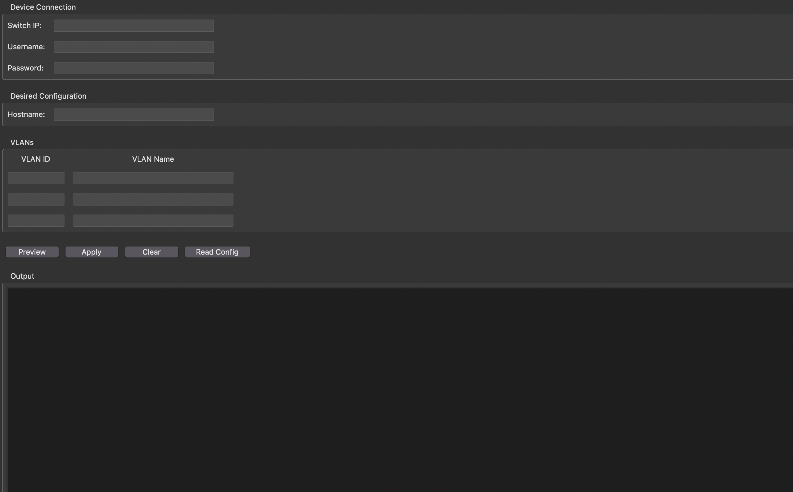

---

### 2. Lectura de configuración actual
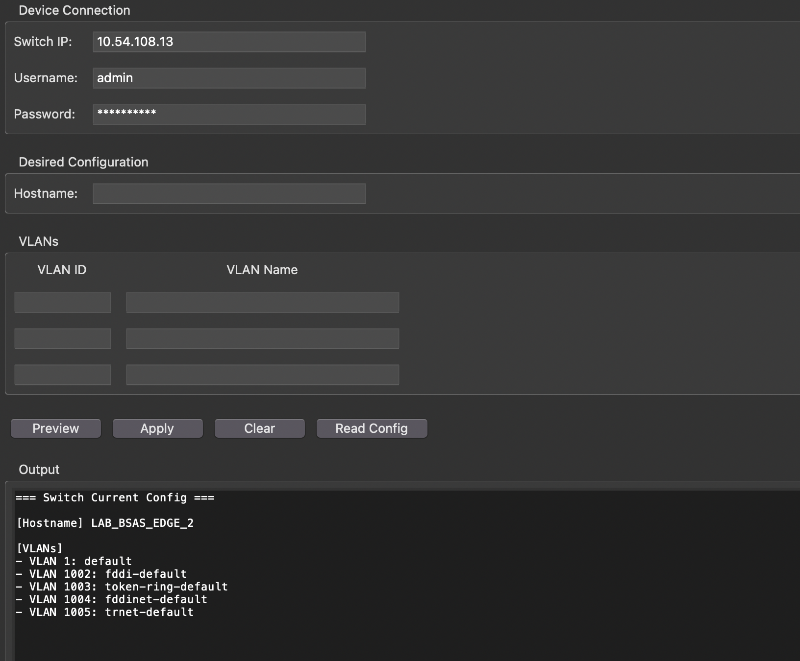

---

### 3. Preview de configuración
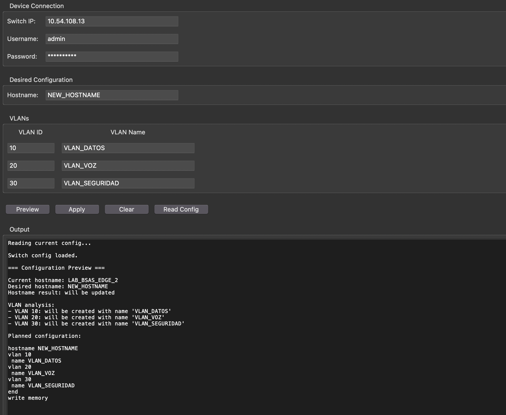

---

### 4. Preview con conflictos detectados
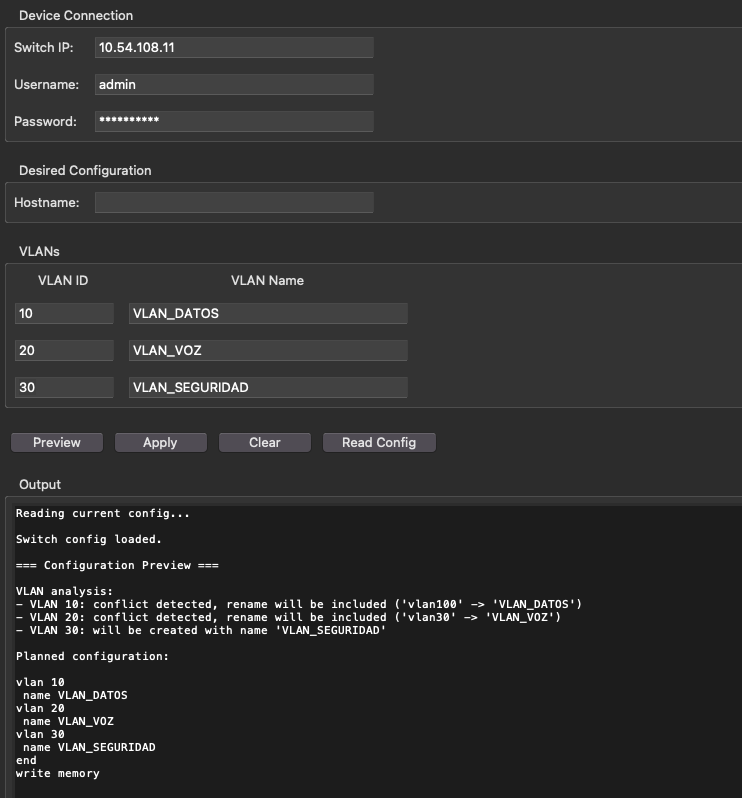

---

### 5. Aplicación de configuración (flujo normal)

#### Paso 1
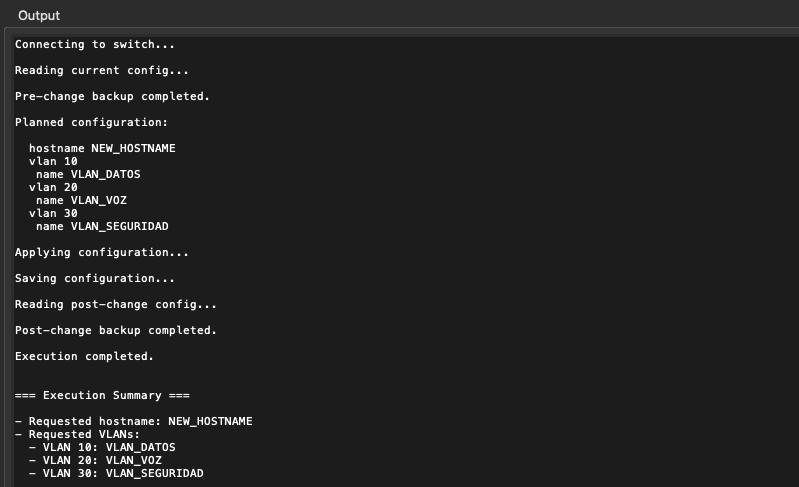

#### Paso 2
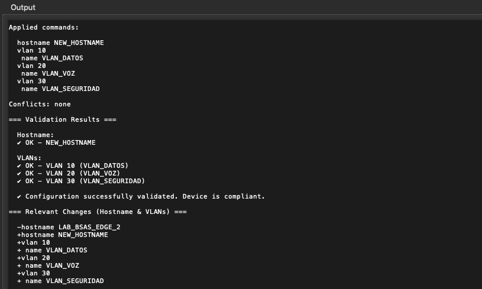

#### Paso 3
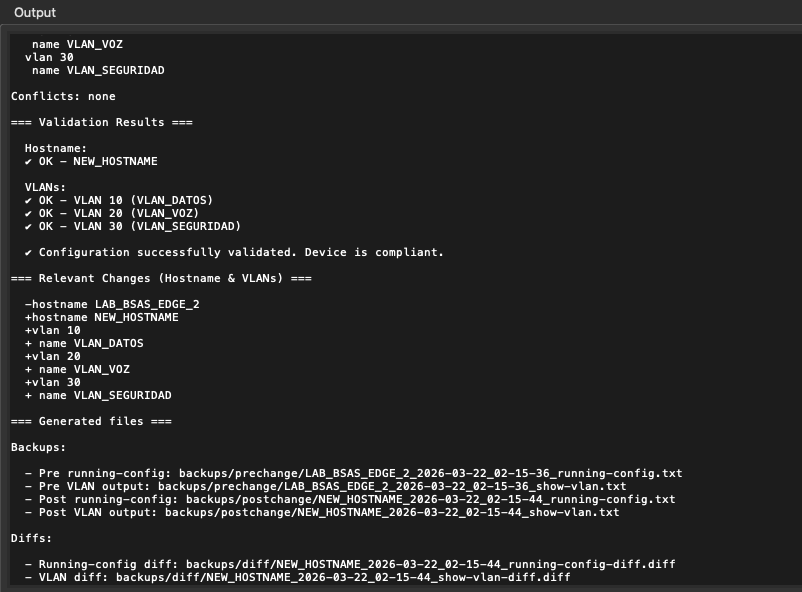

---

### 6. Aplicación con conflictos (confirmación del usuario)

#### Paso 1
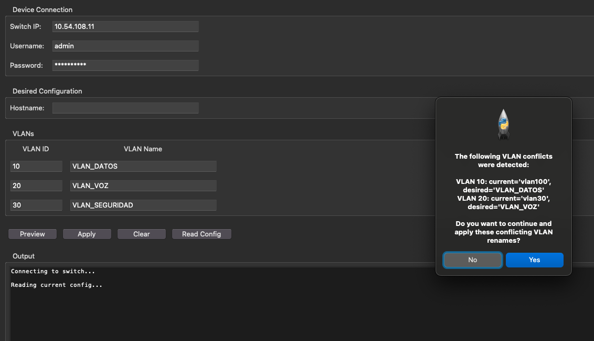

#### Paso 2
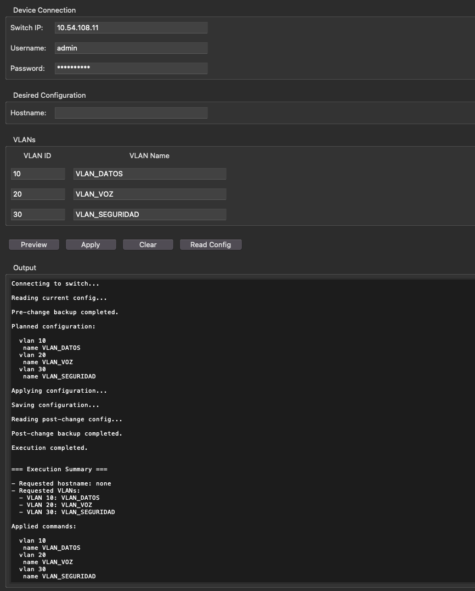

#### Paso 3
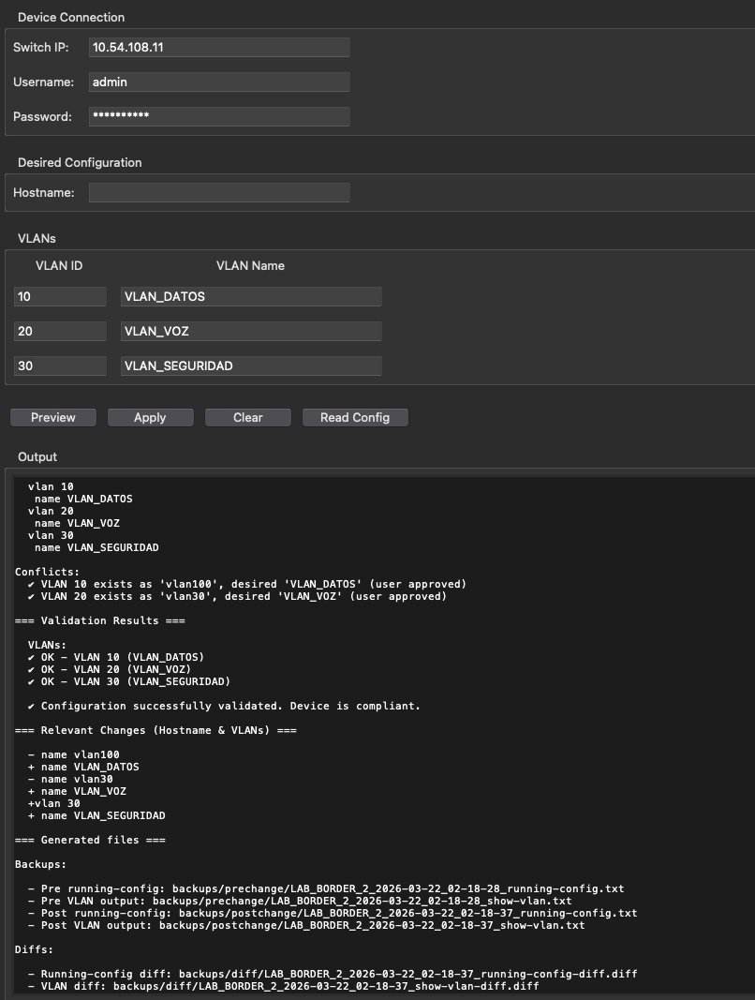

---

### 7. Verificación post cambio
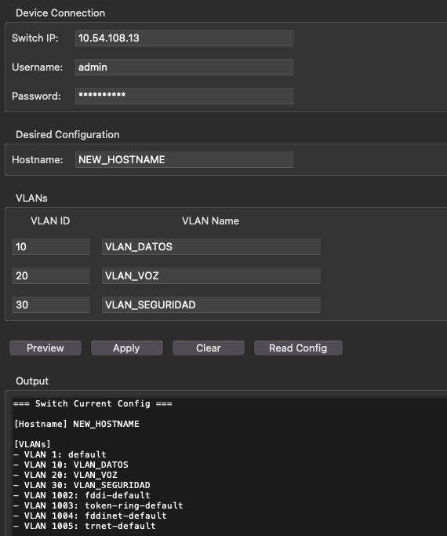